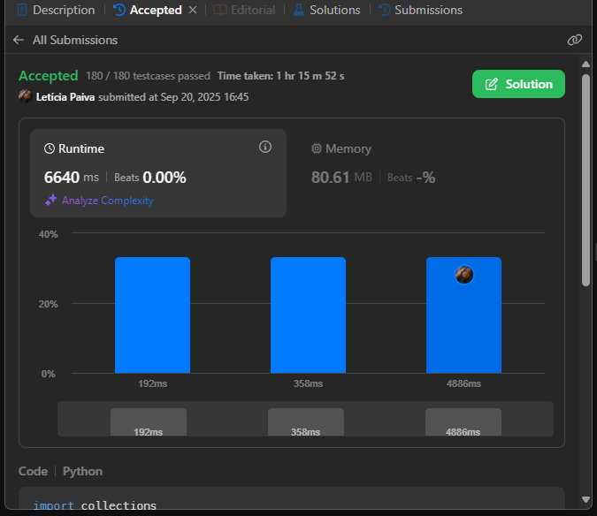
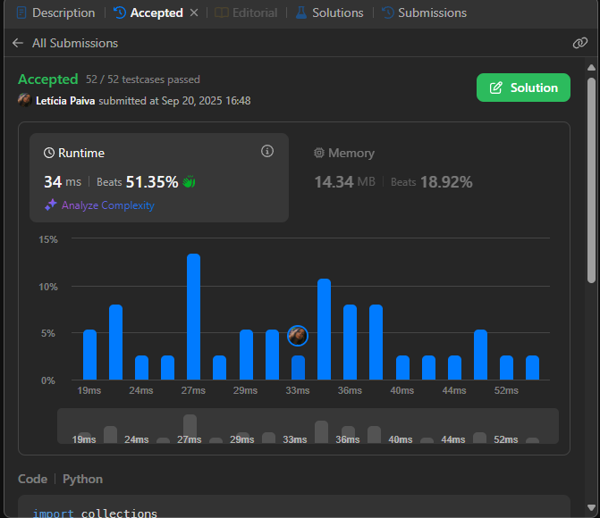

# Grafos 2

**Número da Lista**: 2  
**Conteúdo da Disciplina**: FGA0124 - PROJETO DE ALGORITMOS - T01  

---

## Alunos

<table>
  <tr>
    <td align="center">
      <a href="https://github.com/leticiakrpaiva">
        
         <b>Letícia Paiva</b>
      </a>
    </td>
    <td align="center">
      <a href="https://github.com/Yagoas">
        
         <b>Yago A.</b>
      </a>
    </td>
  </tr>
</table>

| Matrícula   | Aluno                        |
| ----------- | ---------------------------- |
| 22/1037803  | Letícia Kellen Ramos Paiva   |
| 19/0101091  | Yago Amin Santos             |

---

## Sobre

Foram escolhidos 4 exercícios da plataforma **LeetCode**, relacionados ao conteúdo de **Grafos**:

- **2 exercícios de nível difícil**  
- **2 exercícios de nível médio**  

A divisão foi feita da seguinte forma: cada integrante da dupla ficou responsável por **1 exercício de nível médio** e **1 exercício de nível difícil**.  

---

## Exercícios Resolvidos

### [1728. Cat and Mouse II](https://leetcode.com/problems/cat-and-mouse-ii?envType=problem-list-v2&envId=graph)

**Nível:** Difícil  

#### Solução

#### Código
O código da solução está em [`cat-and-mouse-ii.py`](./exercicios/cat-and-mouse-ii.py).

---

### [1311. Get Watched Videos by Your Friends](https://leetcode.com/problems/get-watched-videos-by-your-friends?envType=problem-list-v2&envId=graph)

**Nível:** Médio  

#### Solução

#### Código
O código da solução está em [`get-watched-videos-by-your-friends.py`](./exercicios/get-watched-videos-by-your-friends.py).

---

### [Número. Nome do Exercício](link)

**Nível:** Difícil <!-- ou Médio -->  

#### Solução

#### Código
O código da solução está em [`arquivo.py`](./exercicios/arquivo.py).

---

### [Número. Nome do Exercício](link)

**Nível:** Médio <!-- ou Difícil -->  

#### Solução

#### Código
O código da solução está em [`arquivo.py`](./exercicios/arquivo.py).

---

## Vídeo Apresentação

Neste vídeo, apresentamos a explicação e a solução dos exercícios escolhidos.  

**Link do Vídeo:** [Clique aqui](https://youtu.be/xxxxx) <!-- Substitua pelo link real -->
